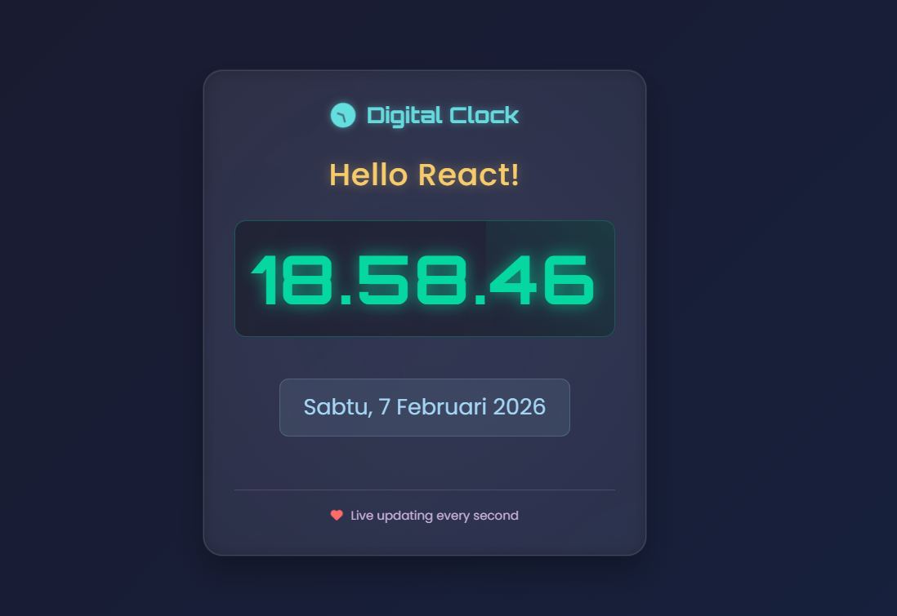

# Digital Clock React App 🕒

A beautiful, modern digital clock built with React using CDN links (no build tools required!) featuring real-time updates, elegant animations, and responsive design.
✨ Features

    ⏰ Real-time Updates - Updates every second without page refresh

    🎨 Modern UI - Glassmorphism design with gradient backgrounds

    🌈 Animations - Smooth animations for clock elements

    📱 Responsive Design - Works on all device sizes

    🎯 Pure React - No build tools, just CDN links

    🔥 Live Elements:

        Dynamic time display (HH:MM:SS)

        Full date display (Day, Month Date, Year)

        Animated icons and separators

 <h2>🎯 LIVE DEMO</h2>  

👉 <a href="https://inspiring-bombolone-9e49ca.netlify.app/" target="_blank" style="font-size: 1.2em; font-weight: bold; color: #00c7b7;">https://inspiring-bombolone-9e49ca.netlify.app/</a>
 

# 🛠️ Technologies Used

    React 18 - Frontend library

    React DOM - DOM rendering

    Vanilla CSS - Custom styling

    Font Awesome - Icons

    Google Fonts - Typography (Orbitron, Poppins)

# 📁 Project Structure

text

digital-clock-react/

├── index.html # Main HTML file

├── style.css # Stylesheet
with all animations

└── README.md # This documentation

🎮 Quick Start
Option 1: Direct Use

    Download the project files

    Open index.html in any modern browser

    That's it! No installation needed

Option 2: Clone & Run
bash

# Clone the repository

git clone https://github.com/ranggautama47/digital-clock-react.git

# Navigate to project directory

cd digital-clock-react

# Open in browser (Mac)

open index.html

# Open in browser (Windows)

start index.html

# Open in browser (Linux)

xdg-open index.html

# 🎨 Customization

Change Time Format

In index.html, modify the toLocaleTimeString options:
javascript

// For 12-hour format with AM/PM
time: now.toLocaleTimeString("en-US", {
hour12: true,
hour: "2-digit",
minute: "2-digit",
second: "2-digit"
})

// For different locale (e.g., Indonesia)
time: now.toLocaleTimeString("id-ID", {
timeZone: "Asia/Jakarta",
hour12: false
})

Change Color Scheme

In style.css, modify the color variables:
css

/_ Primary Colors _/
.time-display {
color: #06d6a0; /_ Change this for clock color _/
}

.greeting {
color: #ffd166; /_ Change this for greeting color _/
}

.date-display {
color: #a9def9; /_ Change this for date color _/
}

Change Animation Speed
css

/_ Slower icon rotation _/
.header i {
animation: spin 20s linear infinite; /_ Changed from 10s _/
}

/_ Faster heartbeat _/
.footer i {
animation: heartbeat 1s infinite; /_ Changed from 1.5s _/
}

# 🎯 How It Works

React Components
javascript

function App() {
// State management for date and time
const [datetime, setDatetime] = React.useState({...});

// useEffect for real-time updates
React.useEffect(() => {
const interval = setInterval(() => {
// Update time every second
}, 1000);
return () => clearInterval(interval);
}, []);

// Render components
return React.createElement(...);
}

CSS Features

    Glassmorphism: backdrop-filter: blur(10px);

    Gradients: background: linear-gradient(...);

    Animations: Keyframes for pulsing, spinning, blinking

    Responsive: Media queries for mobile devices

    Box Shadows: Multi-layered shadows for depth

# 📱 Responsive Breakpoints

| Device  | Breakpoint    | Clock Size |
| ------- | ------------- | ---------- |
| Desktop | > 768px       | 5.5rem     |
| Tablet  | 480px - 768px | 3.5rem     |
| Mobile  | < 480px       | 2.8rem     |

# 🔧 Browser Support

| Browser     | Min Version | Status  | Notes            |
| ----------- | ----------- | ------- | ---------------- |
| **Chrome**  | 60          | ✅ Full | Best performance |
| **Firefox** | 55          | ✅ Full | Good support     |
| **Safari**  | 11          | ✅ Full | iOS compatible   |
| **Edge**    | 79          | ✅ Full | Chromium-based   |
| **Opera**   | 50          | ✅ Full | Works well       |

# 🛠️ Teknologi yang Digunakan

| Technology   | Version | Purpose              |
| ------------ | ------- | -------------------- |
| React        | 18      | UI Library           |
| React DOM    | 18      | DOM Rendering        |
| CSS3         | -       | Styling & Animations |
| Font Awesome | 6.4.0   | Icons                |
| Google Fonts | -       | Typography           |

# 🐛 Troubleshooting

Clock Not Updating?

    Check browser console for errors (F12 → Console)

    Ensure JavaScript is enabled

    Verify React CDN links are accessible

Styling Issues?

    Clear browser cache (Ctrl+Shift+R / Cmd+Shift+R)

    Check CSS file is loaded (F12 → Network)

    Verify Font Awesome CDN is working

Performance Issues?

    Reduce animation complexity in style.css

    Remove unnecessary box-shadows

    Simplify gradient backgrounds

# 🔧 Browser Support

### Browser Version Support

### Chrome 60+ ✅ Full

### Firefox 55+ ✅ Full

### Safari 11+ ✅ Full

### Edge 79+ ✅ Full

### Opera 50+ ✅ Full

### 🤝 Contributing

---

Contributions are welcome! Here's how:

    Fork the repository

    Create a feature branch (git checkout -b feature/AmazingFeature)

    Commit changes (git commit -m 'Add AmazingFeature')

    Push to branch (git push origin feature/AmazingFeature)

    Open a Pull Request

Feature Ideas

    Add timezone selector

    Add alarm functionality

    Add theme switcher (light/dark mode)

    Add world clock comparison

    Add stopwatch/timer features

# 📝 License

This project is licensed under the MIT License - see the LICENSE file for details.

# 🙏 Acknowledgments

    React - The library used

    Font Awesome - For beautiful icons

    Google Fonts - For typography

    CSS Tricks - For design inspiration

# 📊 Project Preview

# 👨‍💻 Author

Rangga Utama

    GitHub: @ranggautama47

 Made with ❤️ and React   ⭐ Star this repo if you found it useful! 

